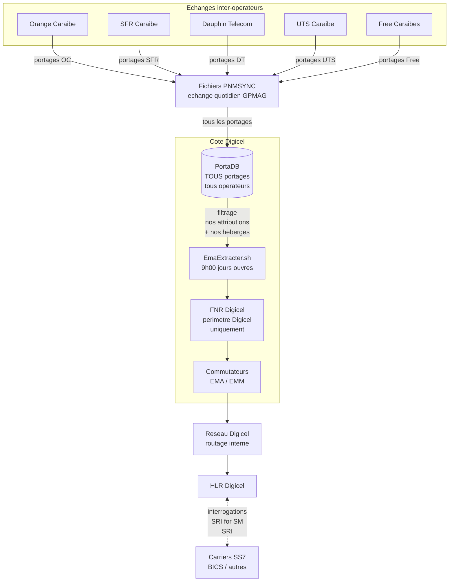
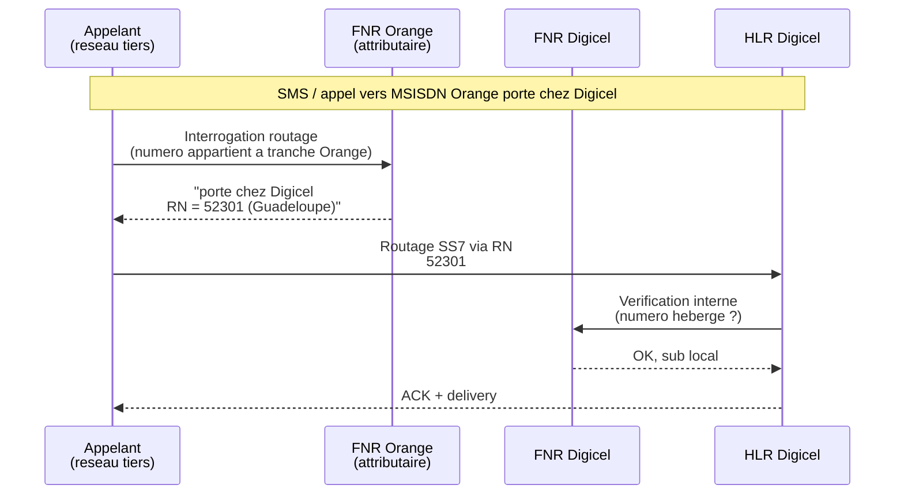
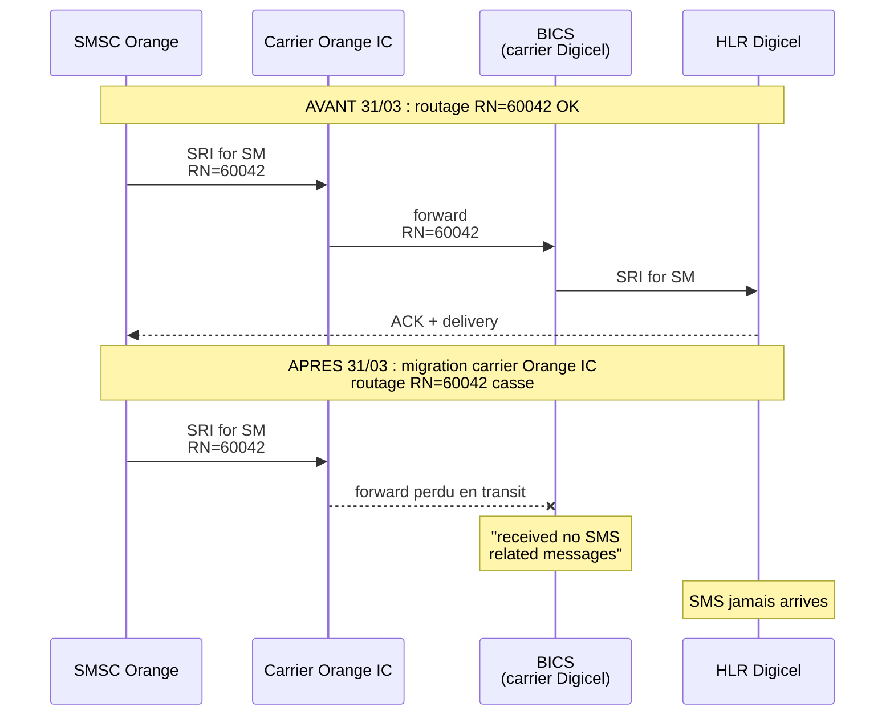

# FNR — Périmètre, visibilité et fonctionnement

**Dernière MAJ :** 05/05/2026

Note explicative sur **ce que contient** le FNR généré par Digicel, **qui le voit**, et comment il s'articule avec PortaDB et les autres opérateurs.

---

## 1. Périmètre du FNR Digicel

Le FNR contient **uniquement les exceptions de routage** (= les portages effectivement réalisés). Un MSISDN qui n'a jamais été porté n'a **pas besoin** d'entrée dans le FNR : il est routé par défaut via sa tranche d'attribution.

Le FNR que **nous** générons (via `EmaExtracter` à 9h chaque jour ouvré) couvre donc :

| Cas | Présent dans notre FNR ? | Pourquoi |
|-----|--------------------------|----------|
| MSISDN **attribué à Digicel** (OPA), encore chez Digicel, **jamais porté** | ❌ Non | Routage par défaut via la tranche/NDC, pas d'entrée FNR nécessaire |
| MSISDN **attribué à Digicel**, porté chez un autre opérateur (PSO) | ✅ Oui | Stocke le RN de l'opérateur receveur (ex: `52303` pour OC Guadeloupe) |
| MSISDN **attribué à un autre opérateur**, porté chez Digicel (PEN) | ✅ Oui | Pour que notre réseau interne route localement vers notre HLR |
| MSISDN **attribué à un autre opérateur**, encore chez lui | ❌ Non | Pas notre périmètre — FNR de l'opérateur attributaire |
| Portage **entre deux tiers** (ex: Orange → SFR) | ❌ Non | Ne nous concerne pas pour le routage |

→ Notre FNR contient les **portages effectifs** qui nous concernent : nos numéros sortis (PSO) + les numéros entrés chez nous (PEN). Les numéros « jamais portés » (chez nous ou ailleurs) ne sont pas dans le FNR.

---

## 2. Schéma — flux de génération et de partage



---

## 3. Distinction PortaDB vs FNR

À ne pas confondre :

| Système | Périmètre | Source | Usage |
|---------|-----------|--------|-------|
| **PortaDB** (base PNM) | **Tous** les portages tous opérateurs (Orange↔SFR, DT↔Free, etc.) | Synchronisé via PNMSYNC quotidien | Référence métier, requêtes, facturation |
| **FNR Digicel** (fichier de routage) | Uniquement nos attributions + nos hébergés | Extrait de PortaDB par `EmaExtracter` | Routage du réseau Digicel |

**Exemple :**

- `0596123456` attribué à Orange, porté chez SFR
- → ✅ Dans notre **PortaDB** (info complète via PNMSYNC)
- → ❌ Pas dans notre **FNR** (ne nous concerne pas pour le routage)

---

## 4. Visibilité du FNR Digicel par les autres opérateurs

**Oui, et c'est essentiel** au fonctionnement du PNM. Le FNR fait partie de l'infrastructure inter-opérateurs partagée.

| Mécanisme | Contenu | Bénéficiaires |
|-----------|---------|---------------|
| **Fichiers PNMSYNC** (synchronisation quotidienne) | Delta des portages : nouveaux + restitutions | Tous les opérateurs GPMAG |
| **PNMDATA tickets 1410** (ordre de portage) | Diffusé à tous les opérateurs lors d'un nouveau portage | OPR + OPD + autres |
| **Interrogation SS7 / SRI for SM** | Quand un appel/SMS arrive vers un de nos numéros, l'opérateur appelant interroge notre HLR/FNR | Tout réseau qui veut router vers Digicel |
| **EMA / EMM extracts** | Fichiers de routage transmis à nos commutateurs et à EMM | Réseau Digicel + carrier (BICS) |

**Important :** un autre opérateur ne fait **pas** un `SELECT *` direct sur notre PortaDB. L'interrogation passe par les protocoles standards SS7/IMSI/HLR ou par les fichiers échangés via le **Guichet Unique GPMAG** (sFTP).

---

## 5. Schéma — qui voit quoi pour un portage Orange → Digicel



→ Le FNR Orange est interrogé en premier (attributaire), puis le routage atteint Digicel via le RN.

---

## 6. Schéma — Pourquoi le bug SMS du 31/03/2026



**Résolution** : passage progressif aux nouveaux RN territorialisés (`52301/52311/52331` côté Digicel). La migration historique du 04/05/2026 a basculé tous les anciens portages encore actifs.

---

## 7. Synthèse à retenir

```
FNR Digicel = base des EXCEPTIONS de routage (= portages effectifs)
              - PSO : nos numeros sortis (avec RN de l'operateur receveur)
              - PEN : numeros d'autres operateurs entres chez nous

              Les MSISDN "jamais portes" (chez nous ou ailleurs)
              ne sont PAS dans le FNR — routage par defaut via la tranche

              ↓
              Publie vers les commutateurs Digicel (EMA)
              + Synchronise avec autres operateurs (PNMSYNC)
              + Interroge en temps reel via SS7 (HLR)
              ↓
              VISIBLE par tous les operateurs qui veulent
              router vers un numero porte

PortaDB = vue complete de TOUS les portages tous operateurs
          (incluant les portages entre tiers via PNMSYNC)
```

**Principe clé : un opérateur attributaire = un seul FNR autoritaire**

- Une seule source de vérité par numéro
- Pas de duplication / désync potentielle
- Tout opérateur sait toujours qui interroger pour router (= l'attributaire d'origine, identifié par les **tranches** attribuées par l'ARCEP)

---

## Documents liés

- [rn-routage-prefixes.md](rn-routage-prefixes.md) — Référence des RN anciens et nouveaux
- [gpmag-evolutions-arcep.md](gpmag-evolutions-arcep.md) — Suivi global des évolutions ARCEP
- [sms-portes-orange-diagnostic.md](sms-portes-orange-diagnostic.md) — Diagnostic du bug SMS résolu
- [P15 — Interrogation FNR](../../protocoles/p15-interrogation-fnr.md) — Comment interroger / mettre à jour le FNR
- [P16 — Rollback DAPI suite FNR EMA EMM KO](../../protocoles/p16-rollback-dapi-fnr.md) — Procédure de rollback
