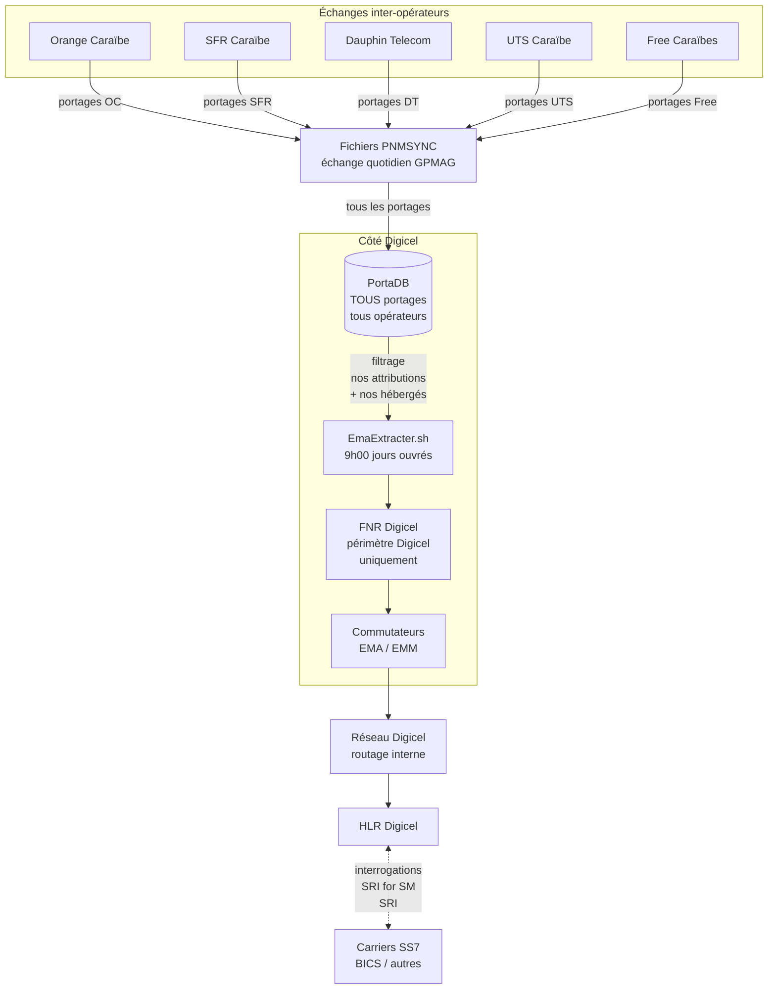

# FNR — Périmètre, visibilité et fonctionnement

**Dernière MAJ :** 06/05/2026

Note explicative sur **ce que contient** le fichier EMA/FNR généré par Digicel, **qui le voit**, et comment il s'articule avec PortaDB et les autres opérateurs.

> ⚠️ **Correction du 06/05/2026** : la version initiale du document disait que les portages entre deux tiers (ex: Orange → SFR) n'étaient pas dans notre FNR. **C'est inexact** — analyse du fichier `ema_YYYYMMDDHHMMSS.txt` généré par `EmaExtracter`. Le fichier EMA est la **table de routage globale du réseau Digicel** et contient **tous les MSISDN portés** (peu importe l'OPA/OPR/OPD), pour que nos commutateurs puissent aiguiller correctement les appels et SMS sortants.

---

## 1. Périmètre du fichier EMA / FNR Digicel

Le fichier EMA contient **uniquement les exceptions de routage** (= les MSISDN portés effectivement). Un MSISDN qui n'a jamais été porté n'a **pas besoin** d'entrée dans le FNR : il est routé par défaut via sa tranche d'attribution.

Le fichier que **nous** générons (via `EmaExtracter` à 9h chaque jour ouvré) couvre donc :

| Cas | Présent dans notre EMA ? | Pourquoi |
|-----|--------------------------|----------|
| MSISDN **attribué à Digicel** (OPA), encore chez Digicel, **jamais porté** | ❌ Non | Routage par défaut via la tranche/NDC |
| MSISDN **attribué à Digicel**, porté chez un autre opérateur (PSO) | ✅ Oui | Stocke le **RN du receveur** (ex: `60044` SFR, `60048` Free) — notre réseau saura où envoyer les appels reçus pour ce numéro |
| MSISDN **attribué à un autre opérateur**, porté chez Digicel (PEN) | ✅ Oui | Stocke notre **RN Digicel** (`52301`/`52311`/`52331` ou ancien `60042`) — pour les requêtes SS7 externes qui passent par notre carrier |
| MSISDN **attribué à un autre opérateur**, encore chez lui | ❌ Non | Pas d'exception, routage par défaut |
| Portage **entre deux tiers** (ex: Orange → SFR, Orange → Free) | ✅ **Oui** | Notre réseau a besoin de savoir aiguiller un appel/SMS sortant vers le **bon receveur**, même quand Digicel n'est pas OPA/OPR/OPD |

→ Le fichier EMA contient **tous les portages effectifs** dont notre réseau a besoin pour router correctement, **y compris les portages entre tiers**. Les numéros « jamais portés » sont absents (routage par défaut suffit).

### Exemple concret (extrait `ema_20260506090108.txt`)

```
CREATE:NPSUB:MSISDN,590690000201:NP,52303;   ← 0690 (tranche Orange) → Digicel Guadeloupe
CREATE:NPSUB:MSISDN,590690009621:NP,60048;   ← 0690 (tranche Orange) → Free
CREATE:NPSUB:MSISDN,590690083952:NP,60044;   ← 0690 (tranche Orange) → SFR
CREATE:NPSUB:MSISDN,594694042332:NP,60048;   ← 0694 (tranche Orange) → Free
DELETE:NPSUB:MSISDN,590690062014;             ← Restitution : retour chez l'OPA, on retire l'entrée
SET:NPSUB:MSISDN,590690068232:NP,52303;       ← Mise à jour d'une entrée existante
```

Les lignes `60044` (SFR) et `60048` (Free) sont des **portabilités étrangères** : Digicel n'est ni OPA, ni OPR, ni OPD. Elles sont présentes pour permettre à nos commutateurs de router correctement les appels sortants émis par nos clients vers ces numéros.

---

## 2. Schéma — flux de génération et de partage



---

## 3. Distinction PortaDB vs fichier EMA

À ne pas confondre :

| Système | Périmètre | Source | Usage |
|---------|-----------|--------|-------|
| **PortaDB** (base PNM) | **Tous** les portages tous opérateurs (Orange↔SFR, DT↔Free, etc.) | Synchronisé via PNMSYNC quotidien | Référence métier, requêtes, facturation, audit |
| **Fichier EMA** (table de routage) | **Tous les portages effectifs** (= portages encore actifs, restitutions exclues) | Extrait de PortaDB par `EmaExtracter` à 9h | Routage SS7 du réseau Digicel + carrier (BICS) |

**Exemple :**

- `590690009621` attribué à Orange, porté chez Free
- → ✅ Dans notre **PortaDB** (info complète via PNMSYNC)
- → ✅ Aussi dans notre **EMA** : `CREATE:NPSUB:MSISDN,590690009621:NP,60048;` — pour que nos commutateurs sachent envoyer un éventuel appel/SMS sortant chez Free

---

## 4. Visibilité du FNR Digicel par les autres opérateurs

**Oui, et c'est essentiel** au fonctionnement du PNM. Le FNR fait partie de l'infrastructure inter-opérateurs partagée.

| Mécanisme | Contenu | Bénéficiaires |
|-----------|---------|---------------|
| **Fichiers PNMSYNC** (synchronisation quotidienne) | Delta des portages : nouveaux + restitutions | Tous les opérateurs GPMAG |
| **PNMDATA tickets 1410** (ordre de portage) | Diffusé à tous les opérateurs lors d'un nouveau portage | OPR + OPD + autres |
| **Interrogation SS7 / SRI for SM** | Quand un appel/SMS arrive vers un de nos numéros, l'opérateur appelant interrogé notre HLR/FNR | Tout réseau qui veut router vers Digicel |
| **EMA / EMM extracts** | Fichiers de routage transmis à nos commutateurs et à EMM | Réseau Digicel + carrier (BICS) |

**Important :** un autre opérateur ne fait **pas** un `SELECT *` direct sur notre PortaDB. L'interrogation passe par les protocoles standards SS7/IMSI/HLR ou par les fichiers échangés via le **Guichet Unique GPMAG** (sFTP).

---

## 5. Schéma — qui voit quoi pour un portage Orange → Digicel


→ Le FNR Orange est interrogé en premier (attributaire), puis le routage atteint Digicel via le RN.

---

## 6. Schéma — Pourquoi le bug SMS du 31/03/2026


**Résolution** : passage progressif aux nouveaux RN territorialisés (`52301/52311/52331` côté Digicel). La migration historique du 04/05/2026 a basculé tous les anciens portages encore actifs.

---

## 7. Synthèse à retenir

```
Fichier EMA = TABLE DE ROUTAGE GLOBALE du reseau Digicel
              = tous les EXCEPTIONS de routage (portages effectifs)

              Inclus :
              - PEN Digicel  (numeros entres chez nous)
              - PSO Digicel  (numeros sortis vers ailleurs)
              - Portages ENTRE TIERS (Orange→Free, Orange→SFR, etc.)
                pour que nos commutateurs sachent aiguiller les
                appels sortants emis par nos clients

              EXCLUS :
              - MSISDN jamais portes (chez Digicel ou ailleurs)
                → routage par defaut via la tranche/NDC

              ↓
              Publie vers les commutateurs Digicel (EMA)
              + Synchronise avec autres operateurs (PNMSYNC)
              + Interroge en temps reel via SS7 (HLR)

PortaDB = vue complete de TOUS les portages tous operateurs
          (synchronisee via PNMSYNC quotidien)
          + métadonnées (états, dates, dossier, plateforme kaizen/mastercrm)
```

**Principe clé : un opérateur attributaire = un seul FNR autoritaire**

- Une seule source de vérité par numéro
- Pas de duplication / désync potentielle
- Tout opérateur sait toujours qui interroger pour router (= l'attributaire d'origine, identifié par les **tranches** attribuées par l'ARCEP)

---

## Documents liés

- [rn-routage-prefixes.md](rn-routage-prefixes.md) — Référence des RN anciens et nouveaux
- [gpmag-évolutions-arcep.md](gpmag-evolutions-arcep.md) — Suivi global des évolutions ARCEP
- [sms-portes-orange-diagnostic.md](sms-portes-orange-diagnostic.md) — Diagnostic du bug SMS résolu
- [P15 — Interrogation FNR](../../protocoles/p15-interrogation-fnr.md) — Comment interroger / mettre à jour le FNR
- [P16 — Rollback DAPI suite FNR EMA EMM KO](../../protocoles/p16-rollback-dapi-fnr.md) — Procédure de rollback
