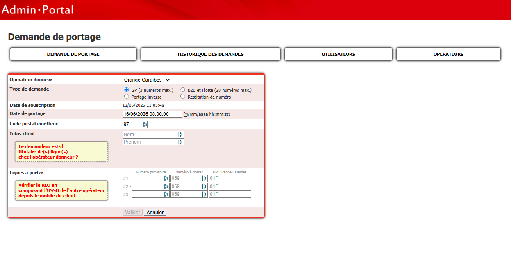
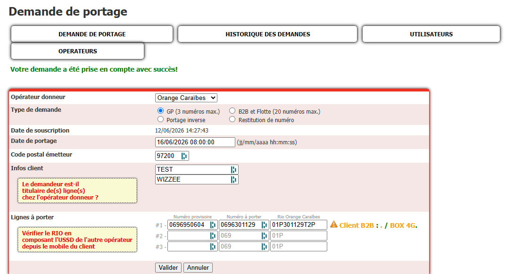

# P47 — Simulation d'une portabilité entrante externe en INT (Orange → Wizzee)

**Catégorie :** Portabilité / Tests
**Environnement :** INT (PortaWebUi intégration — ne jamais dérouler en production)
**Rôles :** Digicel/Wizzee = OPR (02), Orange Caraïbe = OPD (01)
**Suivi :** [Tâche Asana](https://app.asana.com/1/47891937635079/project/1215516595243835/task/1215516595577185?focus=true)
**Créé le :** 12/06/2026

---

## Contexte

Tester en intégration le flux complet d'une portabilité entrante externe vers Wizzee : un abonné Orange porte son numéro chez Wizzee. Orange n'étant pas raccordé à l'environnement INT, **on joue le côté Orange à la main** : la demande (1110) est saisie normalement dans PortaWebUi INT, puis la réponse d'acceptation d'Orange (1210) est fabriquée et injectée manuellement (même principe que le mode dégradé P37/P21, mais en entrée).

## Principe — machine à états attendue

```
[Saisi] ──1110──> [En cours] ──1210 simulé──> [Accepté] ──1410──> [Diffusé]
                                                            ──bascule 9h──> [Basculé] ──1430──> [Confirmé/Clôturé]
```

Seul le **1210 est simulé**. Une fois le portage en état *Accepté*, la chaîne Porta (1410, bascule, 1430) se déroule d'elle-même côté Digicel/Wizzee.

---

## Étape 1 — Choisir un MSISDN compatible portabilité entrante Orange (tranche attributaire = 01)

Le numéro **à porter** doit appartenir à une **tranche Orange** (OPA = 01) et ne pas être déjà connu de la table `MSISDN` (jamais porté, donc toujours réputé Orange).

**Accès INT :** serveur `vmqportaprewebdb01` (`172.24.114.86`) — héberge Tomcat (PortaWs/PortaWebUi) **et** la BDD MySQL. SSH compte `porta_test`, MySQL via le compte applicatif (`-u application`). _Identifiants dans le gestionnaire de secrets / mémoire d'accès locale — jamais dans ce dépôt._

```bash
# SSH par mot de passe → via paramiko (pas de sshpass/plink sous Windows)
mysql -u application -p<***> -t -e "<requête>"
# (Accès prod équivalent : vmqproportawebdb01 / 172.24.119.68, clé porta_pnmv3, mysql socket)
```

```sql
-- (a) Tranches attributaires Orange actives → bornes des numéros portables
SELECT id, debut, fin
FROM TRANCHE
WHERE operateur_id = 1 AND is_active = 1
ORDER BY debut;

-- (b) Vérifier qu'un candidat pris dans une tranche est inconnu de PortaDB
SELECT * FROM MSISDN WHERE msisdn = '0696301129';
-- (aucune ligne = OK ; si une ligne existe, vérifier operateur_id_actuel = 1 et portage_id_actuel IS NULL)
```

### Lister directement 5 candidats valides par territoire (absence de porta vérifiée)

Un numéro est **éligible porta entrante** s'il est natif Orange et **jamais vu dans un échange porta** : absent à la fois de **`MSISDN`** (registre) **et** de **`DATA`** (lignes de tickets). Vérifier les deux est nécessaire : en INT, ~600 numéros figurent dans `DATA` mais pas dans `MSISDN` (portas refusées/annulées/sortantes) — un filtre sur `MSISDN` seul les laisserait passer.

`+1234` vise le milieu de chaque tranche ; `LIMIT 5` par île. Préfixes : `0690` Guadeloupe, `0696` Martinique, `0694` Guyane.

```sql
-- (c1) Guadeloupe — 5 MSISDN Orange natifs (jamais portés)
SELECT c.msisdn
FROM ( SELECT LPAD(CAST(t.debut AS UNSIGNED)+1234,10,'0') AS msisdn
       FROM TRANCHE t
       WHERE t.operateur_id = 1 AND t.is_active = 1 AND t.debut LIKE '0690%' ) c
WHERE NOT EXISTS (SELECT 1 FROM MSISDN m WHERE m.msisdn = c.msisdn)   -- pas dans le registre
  AND NOT EXISTS (SELECT 1 FROM DATA   d WHERE d.msisdn = c.msisdn)   -- aucun ticket porta
LIMIT 5;

-- (c2) Martinique — 5 MSISDN Orange natifs
SELECT c.msisdn
FROM ( SELECT LPAD(CAST(t.debut AS UNSIGNED)+1234,10,'0') AS msisdn
       FROM TRANCHE t
       WHERE t.operateur_id = 1 AND t.is_active = 1 AND t.debut LIKE '0696%' ) c
WHERE NOT EXISTS (SELECT 1 FROM MSISDN m WHERE m.msisdn = c.msisdn)
  AND NOT EXISTS (SELECT 1 FROM DATA   d WHERE d.msisdn = c.msisdn)
LIMIT 5;

-- (c3) Guyane — 5 MSISDN Orange natifs
SELECT c.msisdn
FROM ( SELECT LPAD(CAST(t.debut AS UNSIGNED)+1234,10,'0') AS msisdn
       FROM TRANCHE t
       WHERE t.operateur_id = 1 AND t.is_active = 1 AND t.debut LIKE '0694%' ) c
WHERE NOT EXISTS (SELECT 1 FROM MSISDN m WHERE m.msisdn = c.msisdn)
  AND NOT EXISTS (SELECT 1 FROM DATA   d WHERE d.msisdn = c.msisdn)
LIMIT 5;
```

> **Lire le statut porta dans `MSISDN`.** La colonne `operateur_id_actuel` donne l'opérateur qui **détient** le numéro aujourd'hui : `1` Orange, `2` Digicel/Wizzee, `3` SFR/OMT, `4` Dauphin, `5` UTS, `6` Free.
> - **absent de `MSISDN`** → jamais enregistré = natif de sa tranche (Orange ici) → **éligible entrante** ;
> - présent, `operateur_id_actuel = 1` et `portage_id_actuel IS NULL` → resté chez Orange → éligible ;
> - présent, `operateur_id_actuel = 2` → **déjà porté chez Digicel/Wizzee** → **NON éligible** (le numéro est déjà chez nous).
>
> Exemple vérifié en INT (12/06/2026) : `0690773729` est dans une **tranche Orange** mais `operateur_id_actuel = 2` (porté chez Digicel, `portage_id_actuel = 221815`) → à **exclure** d'une porta entrante. C'est précisément ce que le double `NOT EXISTS` ci-dessus écarte automatiquement.

> ⚠️ **Piège (vérifié le 12/06/2026)** : les préfixes « documentés » (`MSISDN_FINE_PREFIXES` dans `pnm-utils.ts`) sont **trop grossiers** — le découpage réel par `TRANCHE.operateur_id` est plus fin. Ex. `0696018834` semble Orange par préfixe mais tombe en réalité dans la tranche 208 (`0696010000-0696019999`) = **opérateur 3 (SFR/OMT)**. **Toujours valider le numéro à porter contre la vraie table `TRANCHE` (operateur_id = 1)**, sinon le HUB/DAPI rejette : si Wizzee appelle `/v1/createPorta` avec Orange comme donneur sur un numéro non-Orange → **HTTP 412 `DAPI_RECIPIENT_IS_NOT_SUBSCRIPTION_OPERATOR_OF_MSISDN`**.
>
> Tranches Orange MQ actives confirmées (extrait) : 147 `0696200000-…`, 157 `0696300000-…`, 162 `0696370000-…`, 177 `0696800000-…` ; GP : 95 `0690300000-…`.
> Contrôle croisé possible avec P14 (vérification appartenance numéro).

## Étape 2 — Générer le faux RIO Orange

Structure : `OOTRRRRRRCCC` → `01` (Orange) + `P` (particulier) + 6 caractères de référence client + 3 caractères de contrôle.

La référence client (6 caractères) est **arbitraire** : c'est le numéro de dossier interne Orange, que seul Orange pourrait vérifier. En INT, seuls le **format** et la **clé CCC** doivent être cohérents avec le MSISDN.

### Algorithme CCC (validé contre `RIO - tool_v3 For 2025.xlsx`)

- Chaîne d'entrée (19 caractères) : `CodeOp(2) + Type(1) + Ref(6) + MSISDN(10)`
- Table de conversion : `A=0 … Z=25, 0=26 … 9=35, +=36`
- Init `R1=R2=R3=0`, puis pour chaque caractère (valeur X) :
  `R1=(X+R1) mod 37`, `R2=(X+2·R2) mod 37`, `R3=(X+4·R3) mod 37`
- CCC = reconversion de R1, R2, R3 en caractères.

```python
ALPHA = "ABCDEFGHIJKLMNOPQRSTUVWXYZ0123456789+"  # A=0..Z=25, 0=26..9=35, +=36

def rio(op, typ, ref6, msisdn10):
    s = f"{op}{typ}{ref6}{msisdn10}".upper()
    assert len(s) == 19
    r1 = r2 = r3 = 0
    for ch in s:
        x = ALPHA.index(ch)
        r1, r2, r3 = (x + r1) % 37, (x + 2*r2) % 37, (x + 4*r3) % 37
    return f"{op}{typ}{ref6}{ALPHA[r1]}{ALPHA[r2]}{ALPHA[r3]}"

# Exemple de contrôle (outil Excel) : rio("02","P","131780","0696100152") == "02P131780R0W"
```

> Le validateur de format est aussi disponible dans pnm-app (*Outils → RioValidator*), et l'outil Excel de référence est `OneDrive\Documents\Porta_Steeven\RIO\RIO - tool_v3 For 2025.xlsx`.

## Étape 3 — Saisir la demande (1110) dans PortaWebUi INT

Admin Portal INT (`http://172.24.114.86:8080/PortaWebUi/` — hôte `vmqportaprewebdb01`, Tomcat) → **Demande de portage** :



1. **Opérateur donneur** : Orange Caraïbes — **Type de demande** : GP (3 numéros max.).
2. Renseigner : **date de portage** (J+2 ouvrés min, 08:00:00), **code postal émetteur** (97x), nom/prénom client, puis par ligne : **numéro provisoire** (libre côté Digicel/Wizzee, voir ci-dessous), **numéro à porter** (`069…`, étape 1) et **RIO Orange Caraïbes** (`01P…`, étape 2).

### Trouver un numéro provisoire (numéro Digicel libre — « stock 211 »)

Le numéro provisoire est un MSISDN **Digicel réaffectable** sur lequel la ligne est créée avant bascule. Les numéros libres sont dans MasterCRM `PB.MSISDN` (`ST_MSISDN_ID = 0`, `MSISDN_STATUS = 7`, `MS_CLASS = 0`).

**Accès :** pas de connexion directe à MasterCRM → via le serveur de scheduling `vmqprostdb01` (compte `oracle`, SSH RSA legacy) et un **DB link** vers MasterCRM. Encoder le script distant en base64 et le décoder avec `openssl enc -base64 -d -A | bash`.

```bash
ssh -i ~/.ssh/vmqprostdb01_oracle_rsa \
  -o KexAlgorithms=+diffie-hellman-group14-sha1 -o HostKeyAlgorithms=+ssh-rsa \
  -o PubkeyAcceptedAlgorithms=+ssh-rsa -o MACs=+hmac-sha1 \
  oracle@172.24.114.139 "<sqlplus -S -L / as sysdba ...>"
```

```sql
-- Numéros Digicel libres (stock 211) — candidats « numéro provisoire »
SELECT msisdn_no, ST_MSISDN_ID, MSISDN_STATUS, MS_CLASS
FROM PB.MSISDN@DBL_PB_MCST50A.BTC.COM
WHERE ST_MSISDN_ID = 0 AND MSISDN_STATUS = 7 AND MS_CLASS = 0
  AND rownum <= 12;
```

> ⚠️ `MCST50A` = MasterCRM **production**. Pour un test **INT**, si l'environnement a son propre stock, prendre un numéro libre dans **MasterCRM INT (`MCSTINT`, `172.24.114.205`)** pour que le provisioning à la bascule réussisse. Rester en `SELECT` (ne rien réserver/écrire).

3. Valider → message **« Votre demande a été prise en compte avec succès ! »**



4. **Relever la date de souscription exacte** affichée (ex. `12/06/2026 14:27:43` → `20260612142743`) : elle conditionne l'`id_portage` MD5 du 1210 (étape 4).
5. Vérifier en base INT et **récupérer l'`id_portage` réel** (table `DATA` du 1110 ; éviter le JOIN sur `PORTAGE` qui scanne) :

```sql
SELECT code_ticket, id_portage, date_souscription, rio, date_portage
FROM PortaDB.DATA WHERE msisdn = '0696301129';
-- Exemple vérifié (12/06/2026) :
-- 1110 | 2edf2f024ad3bd81a8add0ef9de3a97d | 2026-06-12 14:27:43 | 01P301129T2P | 2026-06-16 08:00:00
```

> ✅ **Contrôle clé** : cet `id_portage` doit être **identique** à celui calculé pour le 1210. La `date_souscription` (ici `14:27:43`) ≠ la date de **création** du 1110 (`14:52:44`, visible dans *Liste des mandats*) — c'est bien la **souscription** qui alimente le MD5.

6. Le 1110 part dans le fichier `PNMDATA.02.01.<horodatage>.<seq>` à la vacation suivante (10H/14H/19H). En INT, il n'est lu par personne — c'est normal.

> ⚠️ **Alerte profil du numéro provisoire.** Si PortaWebUi affiche un avertissement type *« Client B2B / BOX 4G »* à côté de la ligne, c'est que le **numéro provisoire** choisi porte un profil résiduel dans le CRM (cas typique d'un numéro pris dans le stock **production** au lieu de l'INT). Pour un test GP propre, prendre un provisoire au **profil neutre / grand public** libre côté INT. L'avertissement n'est pas bloquant pour la saisie, mais peut fausser le provisioning à la bascule.

### Adapter selon le territoire / la tranche

Le RIO reste préfixé `01P` quel que soit le territoire (code opérateur + type client). Ce qui change par île :

| Territoire | Code postal émetteur | Tranches Orange (n° à porter) | Provisoire Digicel | Préfixe FNR Orange |
|-----------|----------------------|-------------------------------|--------------------|--------------------|
| Guadeloupe | `971xx` | `0690`, `0691` | `0694` / `0695` libre | `52303` (anc. `60041`) |
| Martinique | `972xx` | `0696`, `0697` | `0696` / `0694` libre | `52313` |
| Guyane | `973xx` | `0694` (sous-tranches Orange) | `0694` libre | `52333` |

- Le **numéro à porter** doit tomber dans une **tranche Orange active du même territoire** (étape 1, table `TRANCHE`).
- Le **numéro provisoire** doit être un Digicel **libre** du même territoire (étape « stock 211 »).
- Le **code postal émetteur** doit correspondre au territoire (971/972/973).

## Étape 4 — Simuler le 1210 d'Orange

> ⛔ **Prérequis d'ordre — le portage doit être en *En cours*, PAS en *Saisi DP*.**
> Le 1210 ne peut s'appliquer qu'à un portage déjà passé en **En cours** (le 1110 a été émis à l'étape 3 via la vacation de génération). Si on dépose le 1210 alors que le portage est encore **Saisi DP**, le WS refuse la transition et génère un **ticket 7000 / `E610`** :
> ```
> [E610:0] Transitions disponibles : source:out, context:createPorta, ticket:1110 (DP)
> ```
> (= « depuis Saisi DP, la seule transition possible est l'émission du 1110 »).
> **Pire — le 1210 prématuré corrompt la procédure** : tant qu'il est en base, l'émission du 1110 ne passe plus et produit un **2ᵉ 7000/E610, cette fois émis au partenaire** :
> ```
> [E610: L'ID portage existe déjà mais réception d'un flux non attendu dans la procédure (prise en compte avant ordre de portage)]
> ```
> Le portage **reste bloqué en Saisi DP**. **Un simple re-dépôt ne récupère PAS.** Récupération : soit **supprimer en base le 1210 prématuré + les 7000** (`DELETE FROM DATA WHERE id IN (…)` en INT) puis ré-émettre le 1110, soit **abandonner le portage** (« Clôturer » → cancelPorta/1510 → *Annulé*) et **recommencer sur un numéro vierge mono-portage**.
> **Ordre correct** : (3) émettre le 1110 → *En cours* → vérifier l'état → (4) déposer le 1210.
> Cas vérifié le 17/06/2026 (INT) : `0696096697`, 1210 A001 déposé à 09:22 avant le 1110 → 7000/E610 (09:23), puis tentative d'émission 1110 → 7000/E610 « flux non attendu avant ordre de portage » émis à Orange (09:29), portage resté Saisi DP.

Fabriquer un fichier **`PNMDATA.01.02.AAAAMMJJHHMMSS.ZZZ`** (émetteur 01 → destinataire 02) contenant :

| Ligne | Contenu |
|-------|---------|
| Header | `0123456789` + nom-fichier + émetteur `01` + date-début (AAAAMMJJHHMMSS) |
| Ticket 1210 | voir champs ci-dessous |
| Footer | `9876543210` + émetteur `01` + date-fin + nombre-de-lignes `000001` |

Champs du ticket 1210 (RP Accept, OPD → OPR) :

| Champ | Valeur |
|-------|--------|
| code-ticket | `1210` |
| opérateur-origine / destination | `01` / `02` |
| OPR / OPD | `02` / `01` |
| date-souscription | celle du 1110 |
| msisdn | MSISDN Orange du test |
| **id-portage** | **le même MD5 que le 1110** (étape 3 — sinon le ticket ne raccroche pas au portage) |
| numéro-de-ligne | séquentiel |
| code-acceptation-ou-refus | `A001` (demande éligible) |
| date-création-ticket | horodatage du fichier |

> Le générateur **pnm-app → Outils → PnmDataGenerator** construit ce fichier (header/footer, MD5 id-portage selon Annexe 4). Script CLI équivalent : `tests-int/gen_1210.py`.

**Exemple concret (test du 12/06/2026, MSISDN `0696301129`, souscription `20260612142743`) :**

```
0123456789|PNMDATA.01.02.20260612145429.001|01|20260612145429
1210|01|02|02|01|20260612142743|0696301129|2edf2f024ad3bd81a8add0ef9de3a97d|0001|A001|20260612145429||
9876543210|01|20260612145429|000003
```

> `id-portage = md5("02"+"01"+"20260612142743"+"0696301129") = 2edf2f024ad3bd81a8add0ef9de3a97d`.

**Injection (PortaSync INT) :** serveur `vmqportapresync01` (`172.24.114.85`, compte `porta_pnmv3`) — héberge les scripts de bascule, génération et acquittement des vacations. Déposer le fichier dans le répertoire de réception (équivalent INT de `PortaSync/pnmdata/01/arch_recv`), puis lancer le traitement de réception (`PnmDataManager`) ou attendre la vacation.

**Pièges connus :**
- **E008 « fichier déjà reçu »** : la dédup se fait sur émetteur + date du header (pas la séquence). Changer l'horodatage si on réinjecte (cf. mémo Ack dégradé PNM).
- Séquence `ZZZ` : doit être cohérente avec la table `FICHIER` INT pour l'émetteur 01.
- Pour tester un **refus**, même fichier avec `code-ticket 1220` et `code-acceptation-ou-refus = Rnnn` (ex. `R123` RIO incorrect) → état attendu *Refusé*.

## Étape 5 — Vérifications

1. Après ingestion du 1210 : portage en état **Accepté** ; `PNMDATA` contient le ticket 1210 rattaché à l'`id_portage`.
2. Vacation suivante : génération du **1410** (`PNMDATA.02.00...`, diffusion à tous) → état *Diffusé*.
3. Bascule 9H le jour J : état *Basculé* — vérifier les actions provisioning côté Wizzee/CRM (ChangeMsisdn, NotifyPortage(ACCEPTE), FNR si câblé en INT).
4. Clôture sur réception des 1430 (à simuler de la même façon que le 1210 si le test doit aller jusqu'à *Clôturé*).

```sql
-- Suivi de l'état
SELECT P.id_portage, E.nom AS etat, P.date_portage
FROM PORTAGE P JOIN ETAT E ON P.etat_id_actuel = E.id
WHERE P.id_portage = '<MD5>';
```

## Références

- `docs/pnm/pnm-porta-body.md` — structures fichiers/tickets, diagrammes d'état (§4.1 entrante)
- `docs/reglementaire/annexes-inter-operateurs.md` — codes A/R/E, Annexe 4 (id-portage MD5)
- P37 / P21 — création manuelle de PNMDATA (mode dégradé), P22 — 1210 en attente, P14 — appartenance numéro
- [Tâche Asana de suivi](https://app.asana.com/1/47891937635079/project/1215516595243835/task/1215516595577185?focus=true)
